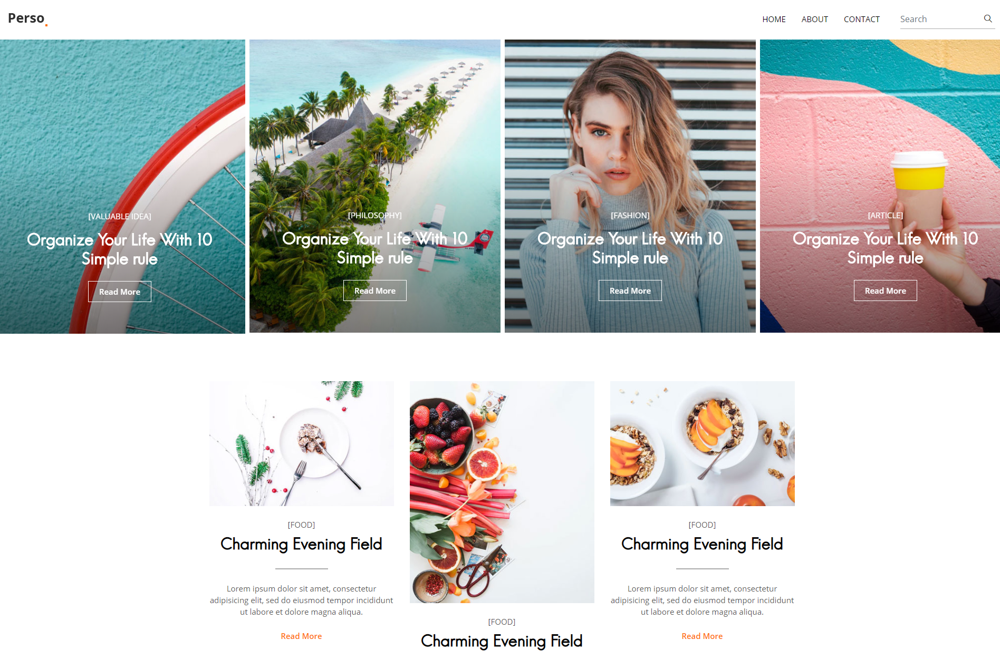
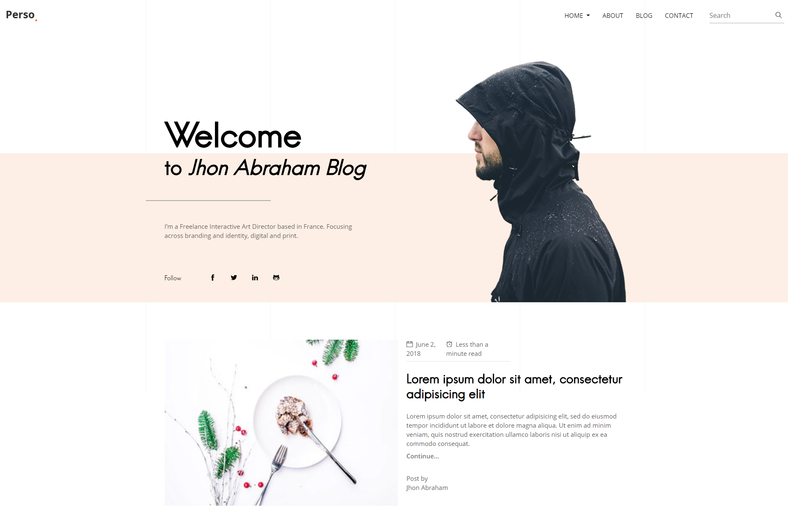
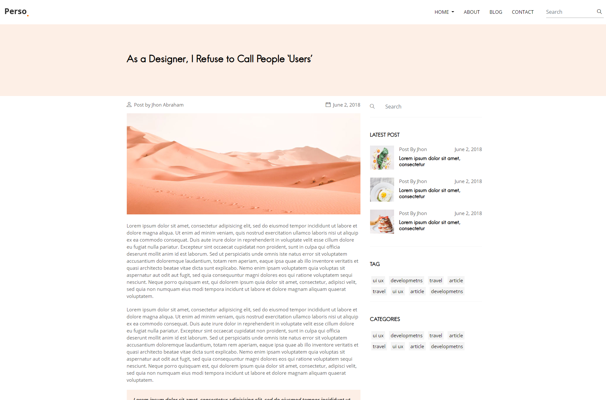
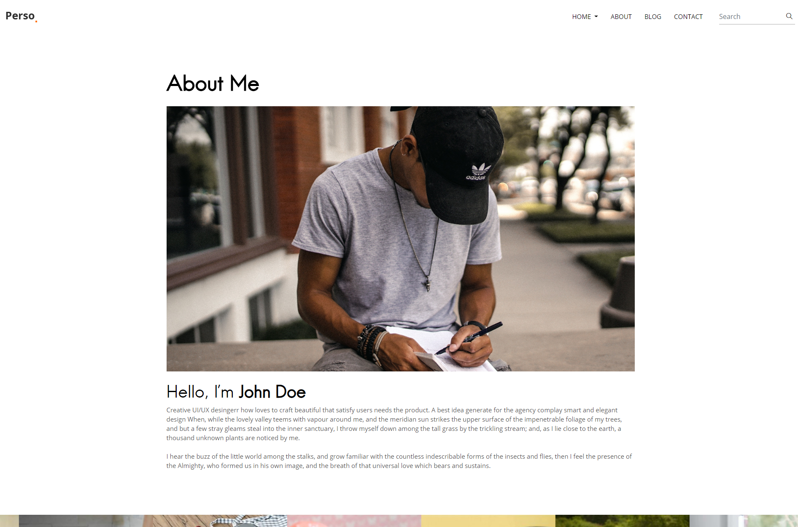
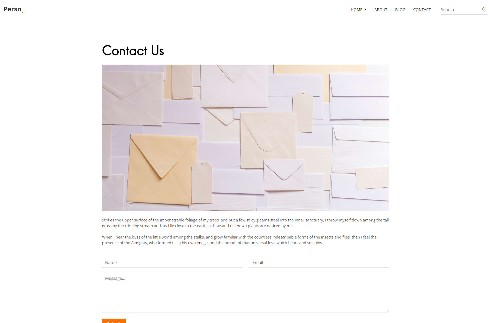

<div align="center">

# <a href="https://themefisher.com/" target="_blank" rel="noopener noreferrer">Parsa Hugo Template(MIT License)</a>


</div>

<div align="center">

</div>

**Parsa Blog Templates** - Parsa is an expedite, cozy, gorgeous responsive personal blog template. It’s crafted with well-planned attention for a personal blog site. It features an affluent search bar that allows your visitors to find out their desired blog post quickly. Moreover, beginners friendly feature allows for easy installation and customization. The functional features allow you the basic customization of your website effortlessly. Parsa is based on the bootstrap framework and responsive to all modern devices and browsers.

## Table of Contents

- [Demo](#demo)
- [Installation](#installation)
- [Reporting Issues](#reporting-issues)
- [Technical Support or Questions](#technical-support-or-questions)
- [Licensing](#licensing)
- [More Hugo Themes](https://themefisher.com/hugo-themes/)

## Demo

| Homepage  | Homepage 2  | Single  | About  | Contact  |
|---|---|---|---|---|
|  |  |  |  |  |

[Live Preview](https://themes.gohugo.io/theme/parsa-hugo/).


## Installation

Navigate to your themes folder in your Hugo site and use the following commands:

```
$ mkdir themes
$ cd themes
$ git clone https://github.com/themefisher/parsa-hugo.git
```

## Reporting Issues

We use GitHub Issues as the official bug tracker for the **Kross Theme**. Please Search [existing issues](https://github.com/themefisher/parsa-hugo/issues). It’s possible someone has already reported the same problem.
If your problem or idea is not addressed yet, [open a new issue](https://github.com/themefisher/parsa-hugo/issues/new)

## Technical Support or Questions

If you have questions or need help integrating the product please [contact us](mailto:themefisher@gmail.com) instead of opening an issue.

## Licensing

- Copyright 2019 Themefisher (https://themefisher.com/)
- Licensed under MIT (https://github.com/themefisher/parsa-hugo/blob/master/LICENSE)


## Premium Themes

| Biztrox  | Bexer  | Small Apps  |
|---|---|---|
| [](https://themefisher.com/products/biztrox-hugo-template/)  | [](https://themefisher.com/products/bexer-hugo-theme/) | [](https://themefisher.com/products/small-apps-hugo-app-landing-theme/) |
| Dtox | Agico | Airspace |
| [](https://themefisher.com/products/dtox-hugo-theme/) | [](https://themefisher.com/products/agico-hugo-theme/) | [](https://themefisher.com/products/airspace-hugo/) |